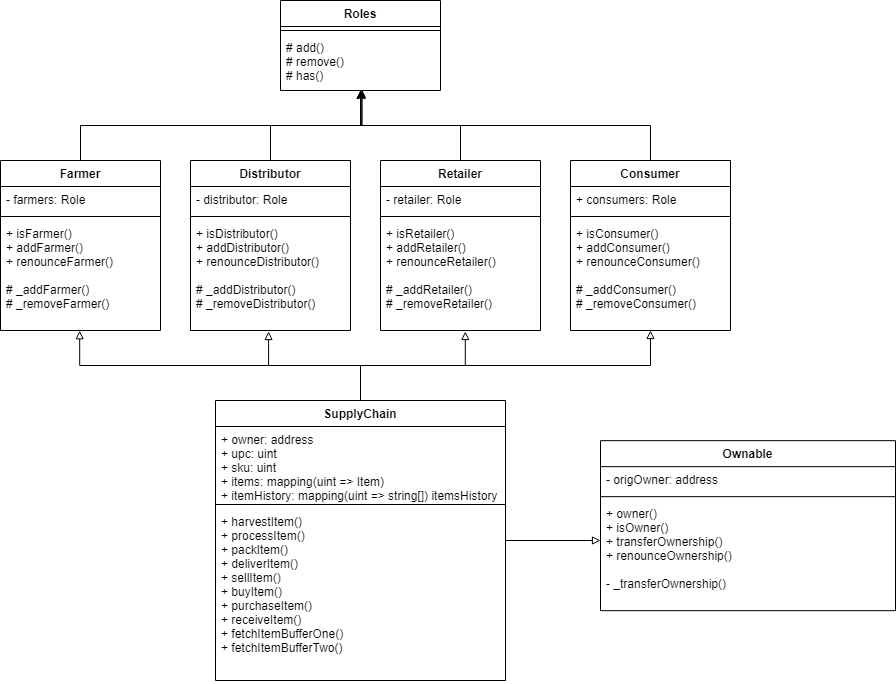
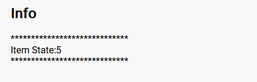
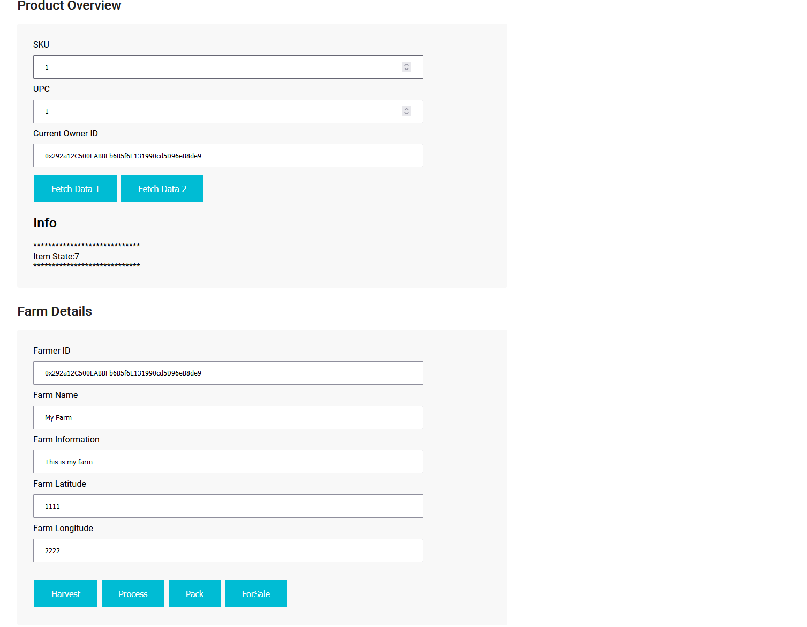

# Supply chain & data auditing

This repository containts an Ethereum DApp that demonstrates a Supply Chain flow between a Seller and Buyer. The user story is similar to any commonly used supply chain process. A Seller can add items to the inventory system stored in the blockchain. A Buyer can purchase such items from the inventory system. Additionally a Seller can mark an item as Shipped, and similarly a Buyer can mark an item as Received.

## Project Write Up

### Activity Diagram

### Sequence Diagram

### State Diagram

### Class Diagram

## Sample Run

## Test Run
* To run the tests for the Contracts, please ensure that truffle is installed.
* In the command line run `truffle develop`
* After the previous command has finished running, run the following command `test`
* The test will start running and the below image is the expected outcome

## App setup and walkthrough
1. Install the necessary dependencies `npm install`
2. Start local ethereum node `truffle develop`
3. Deploy contract onto local node `migrate --reset`
4. In a new command line tab, start the frontend server `npm run dev`
5. Once the server is up and running, go to http://localhost:3000 on your browser with MetaMask plugin installed
6. You should see the following landing page

7. Update UPC field with a value (e.g. `1`) and all the fields under Farm Details (Farmer ID can be address used to deploy this contract). Hit the "Harvest" button.

8. After the transaction is completed, you can verify that it is successful if the "Item State" is getting displayed with the right state.

9. Update the item state with the respective buttons "Process", "Pack".
10. To sell an item, define the Product Price field and hit the "For Sale" button.

11. At this stage, we will be assumming the role of Distributor, hit the "Buy" button. You should see that the Distributor ID field getting updated. 

12. As the Distributor, hit the "Ship" button to mark the item as Shipped.

13. Now, as the Retailer, hit the "Receive" button to receive the item. You should see the fields updated accordingly.

13. Finally, as the Consumer, hit the "Purchase" button to purchase the item.

14. You can also fetch the neccessary details using "Fetch Data 1" and "Fetch Data 2" buttons (make sure to define the UPC before hitting the button). The fetched data will be populated into the respective fields.

## Libraries/Frameworks Used

* [Ethereum](https://www.ethereum.org/) - Ethereum is a decentralized platform that runs smart contracts.
to make the web faster, safer, and more open.
* [Truffle Framework](http://truffleframework.com/) - Truffle is the most popular development framework for Ethereum with a mission to make your life a whole lot easier.
* WebPack - module bundler for JS files
* Node (12.13.1) - JavaScript runtime environment that runs on the V8 engine and 
executes JavaScript code outside a web browser.
* truffle (5.3.10) - development environment, testing framework and deployment pipeline for Ethereum dapps
* @truffle/hdwallet-provider (1.4.0) - HD Wallet-enabled Web3 provider.
* web3 - allows for interactions with a local or remote ethereum node, using a HTTP or IPC connection

## Contract Address & Transaction Hashes
* Contract address - 0xa1b2Ca2E25e1c14443aeB08539618bE188B3776A
* Contract deployment transaction - 0xc7b63b94e605eb3efe233542136e41008384b92515ccb7611789a23c755f92a5
* Harvest transaction - 0xcddd1189b344d071e4ff4e8f6c4abe5d65dec97a05f1197a314c31701366f04b
* Process transaction - 0xbcb5342048e38495271df188cb1ce7f951984e691461271f71c24df9daf0e467
* Pack transaction - 0x799a32c07d01c0dd099a9f7197ca6b3fca0d32f83b9f42e319caf9009e330c61
* Sell transaction - 0xbeeaa8f88ea4008c985491d505c699f2510b51cc792b40fc5f75bbe678c1989f
* Buy transaction - 0x64aa06fcbccfe9015c0aa51fb6b259402368c56f24d79bf6652db9f7924b6f88
* Ship transaction - 
0x13ff9c38f957bd0a81223062f54d0d6b0bc9681df2d4b49e8a365d7173d4aef1
* Receive transaction - 0x064b75daf4dfd942818df4b39a178ed2aeff5d9414b27308224b23d36c7955c7
* Purchase transaction - 
0x7f63c49f55a81894a6084ddefb6d6efb61bf83e0139d2d784ccaae73e998cb44